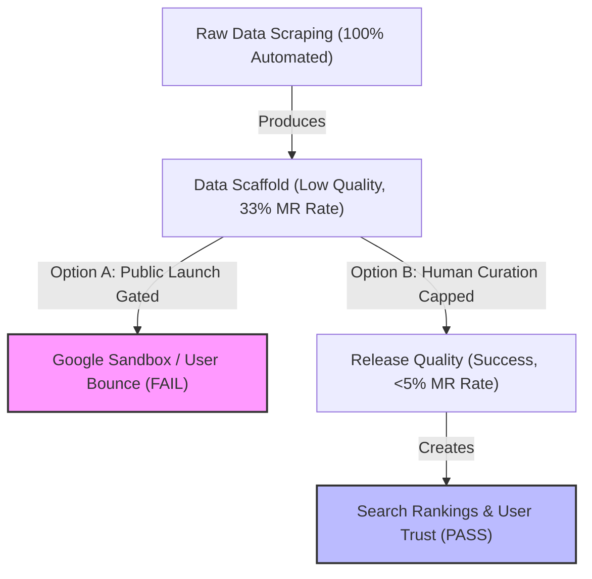

# Founder's Risk Brief: National Disability Directory

**Prepared for:** Founders / Leadership Team  
**Date:** June 14, 2026  
**Auditor:** Antigravity (AI Coding Assistant)  
**Classification:** Confidential Executive Briefing

---

## Executive Summary
This brief outlines the primary existential threats to our platform as we transition from a closed data scaffold to a live public release. While our automation pipeline has successfully ingested all 50 states, the product stands at a critical juncture: **automation has hit its quality ceiling.** 

Moving forward requires a strategic pivot from machine generation to human-in-the-loop validation to avoid Google indexing penalties and user churn.

---

## 1. Existential Risks & Blind Spots

### 🚨 Existential Risk 1: Google Doorway Page Sandbox
* **The Threat:** We have generated over **3,000 county pages** nationally. For gated states, these pages have very high content similarity (often 90%+ boilerplate similarity). Even for Batch 1 (Texas, Florida, Pennsylvania), pages share the same internal layout, link density, and statewide resource cards.
* **The Impact:** If Google's algorithm flags the site as a programmatic doorway network, it will completely de-index the domain or relegate it to page 10+ of search results. This destroys our primary customer acquisition channel.
* **Mitigation:** We must keep all states gated under `noindex` except Batch 1, and manually inject unique descriptive text for the top 50 county hubs to signal custom value to crawlers.

### 🚨 Existential Risk 2: The Manual Curation Bottleneck
* **The Threat:** Out of 18,100 records, **33.65% (6,091 records)** are marked `manual_review_required`.
* **The Reality:** 83.88% of our school districts and 73.14% of county Medicaid offices lack verified local phone numbers or contacts. We cannot scrape this data automatically because state agencies do not publish clean local API routes.
* **The Impact:** Scaling to a national launch requires a manual data buildout. If we attempt to "growth hack" this by removing the gates without manual reviews, user trust will drop to zero when parents encounter broken contacts.

### 🚨 Existential Risk 3: Data Decay and Refresh Logistics
* **The Threat:** Directories decay at a rate of 15% to 20% per year (people leave, phone numbers change, agency URLs restructure).
* **The Reality:** We do not have an active, automated polling system to verify that our existing 12,000+ "verified" records remain fresh.
* **The Impact:** Within 6 months, a subset of our verified links will lead to dead 404 pages.
* **Mitigation:** Implement weekly cron status checks on all `source_url` fields in the database and flag any redirecting/broken links.

---

## 2. Strategic Trade-Offs: Automation vs. Human Curation

* **Automation Limit:** Scrapers are excellent for finding geographic structures, state-level regulations, and nonprofit registration databases. They fail completely at discovering who the intake coordinator is at a rural county Medicaid office.
* **Human Curation Cost:** Curating a state manually (e.g., verifying 50 school districts and 50 local offices) costs approximately $200–$400 in outsourced VA hours. The total cost to clean up the national manual review queue (6,091 records) is roughly **$15,000–$20,000**. 
* **Recommendation:** Do not attempt to optimize the scrapers further. Allocate budget directly to remote virtual assistants to curate target states one by one.

---

## 3. Immediate Founder Decisions Required

1. **Approve Batch 1 Release:** Launch Texas, Florida, and Pennsylvania immediately. This establishes our first search engine footprints.
2. **Approve California Cleanup Campaign:** Budget 20 VA hours to clear California's 77 fallbacks and 928 unverified advocates so it can be safely used as our flagship state.
3. **Set the Verification Gate at 5.0%:** Establish a permanent policy that no state will be allowlisted in `verifiedCounties.ts` unless its manual review rate is confirmed below 5.0% by standard audit.
