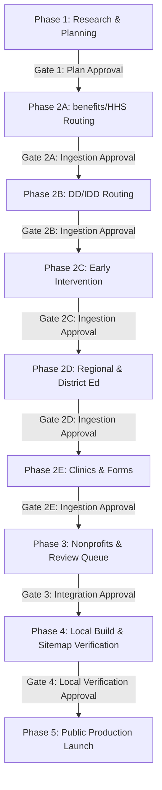

# Reusable National State-Upgrade Playbook

This playbook outlines the rules, architecture, and gate checkpoints for upgrading individual states to California-equivalent data depth and site reliability, incorporating key lessons from the Texas and Florida upgrades.

---

## 1. Architectural Philosophy: The California-Equivalence Goal

Every state added to the Special Needs Disability Navigator must undergo a rigorous, stage-gated upgrade process. We do not release thin or unverified listings to search engines. 
*   **Gating Leaf Pages:** All non-California county × diagnosis leaf pages (e.g., `/counties/texas/harris-tx`) are gated with `noindex` until a state achieves fully verified status.
*   **Catchment Routing:** State benefits must map to the regional routing equivalent of California's Regional Centers (e.g., LIDDAs in Texas, APD Region Offices and Early Steps Portals in Florida).
*   **Overlapping Catchments:** Catchment mappings must support many-to-many relationships in junction tables (e.g., `regional_center_counties`) to handle metropolitan counties served by multiple regional contractors (such as Miami-Dade's split between North Dade and Southernmost Early Steps).
*   **Geographic Coverage Enforcement:** Every county-level or regional office category must cover 100% of the target state's counties, ensuring zero unmapped counties before promotion.

---

## 2. The One-State-at-a-Time Rule

> [!CRITICAL]
> **Strict Serialization**: To ensure quality and prevent developer distraction, only one state can undergo the upgrade process at a time.
> No work may begin on State N+1 until State N has passed all verification gates and is flagged as launch-ready.
> 
> **Ohio was the post-autonomy control state and has successfully PASSED all gates.**
> (Status: PASSED. Multi-state batching of approved low-risk categories is now ACTIVE. **Geographic local routing layers are strictly suspended from batch promotion** and must remain in single-state mode. School district replacements, primary key re-keying, and regional catchments must be processed state-by-state.)

---

## 3. The Save-Point Checkpoint System

To ensure accountability and transparency, the upgrade of each state must write standard checkpoints to disk. Every stage must produce:
1.  **Markdown reports** in `docs/state-upgrades/[state]/` detailing the outcomes of that stage.
2.  **JSON data artifacts** in `data/state-upgrades/[state]/` representing the structured findings (e.g., target lists, gap reviews).
3.  **Audit metrics and builds** confirming compile-time and run-time safety.
4.  **Rollback plans** detailing the exact steps to revert code and database changes.

---

## 4. State-Upgrade Sequence and Approval Gates

Every state upgrade is structured into sequential sub-phases, each separated by an explicit gate. Developers must work category-by-category rather than running mixed-batch runs.



### Phase 1: Research & Planning
*   **Activities:** Define the state's structure, compile official source URLs, and list data gaps.
*   **Artifacts Written:**
    *   `docs/state-upgrades/[state]/00-baseline.md`
    *   `docs/state-upgrades/[state]/01-resource-truth-map.md`
    *   `docs/state-upgrades/[state]/02-gap-analysis.md`
    *   `docs/state-upgrades/[state]/03-pull-plan.md`
    *   `data/state-upgrades/[state]/source_targets.json`
*   **APPROVAL GATE 1:** Review research findings, gap list, and pull plan. No script writing or scraping is allowed until approved.

### Phase 2: Category Ingestion & Staging (Serial Gates)

No category may be written to production until it has completed staging, validation, proposal creation, and approval.

#### Phase 2A: benefits / HHS Local Offices Routing
*   **Goal:** Resolve Medicaid eligibility and HHS storefront routing.
*   **Staging:** Collect local offices into `staging_scraped_county_offices`. Filter community partners/terminals from official storefronts to prevent table clutter.
*   **Outputs:** `docs/state-upgrades/[state]/04-dcf-access-routing.md` (or equivalent), `docs/scraping-vs-seeding/[state]-dcf-access-upgrade-proposal.md`.

#### Phase 2B: DD / IDD / Local Catchment Routing
*   **Goal:** Resolve developmental disability and waiver intake regional catchment routing.
*   **Staging:** Stage regional office boundaries and waitlist registries. Waitlists without official duration estimates must be normalized to `"Not officially stated"`.
*   **Outputs:** `docs/state-upgrades/[state]/05-apd-ibudget-routing.md` (or equivalent), `docs/scraping-vs-seeding/[state]-apd-ibudget-upgrade-proposal.md`.

#### Phase 2C: Early Intervention (Ages 0-3)
*   **Goal:** Resolve Part C early intervention portals and service coordinators.
*   **Staging:** Stage contractor/regional program records. Support many-to-many catchment mapping to handle overlapping metro boundaries.
*   **Outputs:** `docs/state-upgrades/[state]/06-early-steps.md` (or equivalent), `docs/scraping-vs-seeding/[state]-early-steps-upgrade-proposal.md`.

#### Phase 2D: School Districts & Regional Education Support
*   **Goal:** Resolve special education contact directories and ESE structures.
*   **Staging:** Map regional education support agencies (e.g., FDLRS Associate Centers) and ESE school districts.
*   **Re-keying Safety Check:** Run a dependency reference audit before renaming fallback district primary keys (e.g. `sd-{county}-{state}-fallback` to `sd-{county}-{state}`) to ensure no foreign keys reference the old ID.
*   **Outputs:** `docs/state-upgrades/[state]/07-fdlrs-ese.md` (or equivalent), `docs/scraping-vs-seeding/[state]-fdlrs-ese-upgrade-proposal.md`.

#### Phase 2E: Hospital & University Clinics
*   **Goal:** Ingest institutional clinics and official forms.
*   **Staging:** Stage institutional autism/developmental clinics. Separate physical county locations from regional service catchment texts. Stage official state forms directly into production.
*   **Outputs:** `docs/state-upgrades/[state]/08-card-clinics.md` (or equivalent), `docs/scraping-vs-seeding/[state]-card-clinics-upgrade-proposal.md`.

### Phase 3: Nonprofits & Review Queue
*   **Goal:** Seed local support organizations (PTI chapters, Arc chapters, CILs) and generate the private provider legal review queue.
*   **Ingestion Rule:** Stage and merge local nonprofits to replace statewide fallbacks. Move all commercial legal, advocacy, and therapy resources to a localized `provider_legal_review_queue.json` file for manual credential verification rather than promoting them directly to production.
*   **Outputs:** `docs/state-upgrades/[state]/09-trusted-nonprofits.md`, `docs/state-upgrades/[state]/10-provider-advocate-legal-review.md`.

### Phase 4: Local Build & Sitemap Verification
*   **Goal:** Register state config in `stateConfigs.ts`, write Playwright spec, run production Next.js build, verify sitemap indices, and execute local smoke tests.
*   **Environment Check:** Ensure the Playwright test runner executes within the `frontend` subdirectory and passes the `DB_ENCRYPTION_KEY` environment variable.
*   **GSC Gate:** New states must remain configured as `noindex` until wave-wide launch validation is completed.

### Phase 5: Public Production Launch
*   **Goal:** Deploy to Vercel, verify live environment variables, run live smoke tests against the public production domain, and request indexation.
*   **Outputs:** `docs/launch/[state]-live-production-verification-report.md`.

---

## 5. Testing and Validation Policy

To optimize execution speed while maintaining database integrity and code safety, we implement a tiered testing policy:

### 1. After Every Phase Promotion
Run fast, isolated data integrity checks immediately (do not run Playwright tests here):
*   **Standard Audit**: Verify state completeness scores using `node --experimental-strip-types src/db/audit_state_standard.js [state]`.
*   **Depth Audit**: Verify depth score and metrics using `node --experimental-strip-types src/db/audit_state_depth.js [state]`.
*   **Mutation Guard**: Assert no changes occurred outside the targeted state using the database checksum checker.
*   **fakeCoverageDetector**: Validate that regional catchments are not mirrored or duplicated (triggered for geographic phases: `benefits_hhs`, `dd_idd`, `early_intervention`, `education_regional`, `district_replacements`).
*   **Rollback SQL Verification**: Generate and verify SQL rollback files to guarantee changes can be reverted.
*   **Before/After Diff Verification**: Confirm and document inserted, updated, and deleted counts.
*   **Provenance Check**: Assert metadata completeness (`source_url`, `evidence_level`, `confidence_score`).
*   **Protected Record Check**: Verify that `curated_seed` and `human_verified` records are preserved and never overwritten.

### 2. After a Full State Upgrade
*   **Next.js Production Build**: Run `npm run build --prefix frontend` to guarantee Next.js static site generation (SSG) compiles successfully.
*   **Targeted State Smoke Test**: Run the targeted state-specific E2E smoke test using Playwright:
    ```bash
    npx playwright test e2e/[state]-launch.spec.ts
    ```
    This avoids running the full suite of other states.

### 3. After a Multi-State Batch or Final Integrated Run
*   **Next.js Production Build**: Recompile the production frontend build.
*   **Full Playwright E2E Suite**: Run the full E2E smoke tests suite (`npx playwright test`) to certify the final global database and route configurations.

### 4. Build Gating Rule
*   If any phase modifies **route generation**, **sitemap/noindex logic**, **frontend rendering logic**, or **database schema**: you **must** compile the production build immediately to fail fast.
*   If a phase only edits **data rows**, full E2E Playwright validation can be safely deferred to the end of the state upgrade or batch run.

---

## 6. Permanent Safety Guardrails & Placeholder Prevention (Georgia/Illinois Lessons)

1. **Placeholder Contact Prevention**: To avoid seeding mock/placeholder contact info (like `555` phone numbers or fake addresses), the staging records must be pre-cleansed prior to promotion.
2. **Database Constraint Compliance**: For text columns defined as `NOT NULL` (like contact phone or email), set them to empty string `""` rather than `null` when clearing placeholder info. The frontend must hide empty strings to prevent rendering blank spaces.
3. **fakeCoverageDetector Exclusions**: Systematic seeding/re-keying phases (such as `district_replacements` or `trusted_nonprofits`) will naturally generate metadata-uniform records with repeated directories. Exclude these phases from the detector's repeated source URL and confidence uniformity checks to prevent false-positive pipeline halts.
4. **Non-Zero Audit Exits**: Standard state audit scripts exit with code `1` when fallbacks/warnings exist, which is expected during a partial state upgrade. The runner's `runFastAudits()` helper should log these non-zero exits as notes rather than crashing the pipeline execution.
5. **Suffix Extraction Safety**: When stripping state suffixes from county identifiers (e.g. removing `-co` from `city-and-county-of-broomfield-co`) to determine canonical record IDs, use precise trailing substring extraction (e.g., `lastIndexOf` or length subtraction) rather than a global/first-occurrence `replace()`. This prevents malformed IDs like `city-andunty` caused by matching subwords (like `co` in `county`).
6. **Sequential Playwright Execution**: When running the full integrated E2E test suite in sandbox environments, execute Playwright sequentially using the `--workers=1` flag. Running tests fully in parallel on resource-limited sandboxes causes CPU starvation, SQLite database lock contention, and network request aborts (like `net::ERR_ABORTED`).

