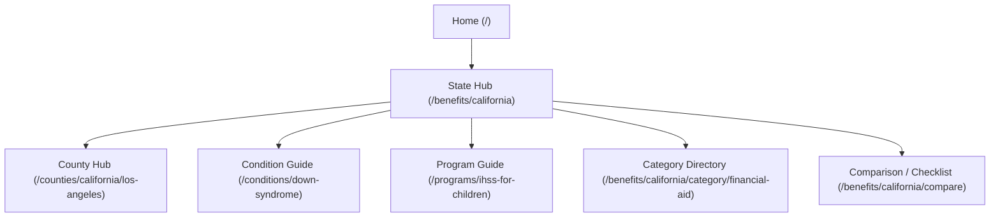

# Ablefull SEO Architecture & Quality Assurance Report

This document outlines the SEO site architecture, metadata specifications, structured data guidelines, and QA criteria implemented to make the Ablefull directory search-engine crawlable, user-trustworthy, and launch-ready.

---

## 1. Audited Current Repository & Routing Structure

Ablefull runs on **Next.js 15 (App Router)** with a backend database on SQLite/PostgreSQL. Pages are served via dynamic or statically prerendered catch-all routes:

1.  **State Directory Hub:** `/benefits/[state]`
    *   *Path:* `src/app/benefits/[state]/[[...slug]]/page.tsx`
    *   *Role:* Acts as the regional directory for a state, rendering counties list, state-wide programs, and condition linkages.
2.  **County Hubs:** `/counties/[state]/[county-slug]` or `/benefits/[state]/[county-slug]`
    *   *Path:* `src/app/counties/[state]/[slug]/page.tsx`
    *   *Role:* Renders county-level directories including catchment agencies (Regional Centers/LIDDAs), school districts, county social services, local parent support chapters, and wage rates.
3.  **Disability / Condition Hubs:** `/conditions/[slug]` or `/benefits/[state]/[diagnosis]`
    *   *Path:* `src/app/conditions/[slug]/page.tsx`
    *   *Role:* Detailed child-focused developmental resources indexed by diagnoses (e.g. Down Syndrome, Autism, CP).
4.  **Program Detail Guides:** `/programs/[slug]`
    *   *Path:* `src/app/programs/[slug]/page.tsx`
    *   *Role:* High-fidelity application playbooks containing intake phone script templates, document checklists, and pediatric evidence requirements.
5.  **Situational Guides / Application Roadmaps:** `/situations/[slug]`
    *   *Path:* `src/app/situations/[slug]/page.tsx`
    *   *Role:* Topic-focused application instructions (e.g. IEP evaluation requests, IHSS Protective Supervision guides).

---

## 2. Ideal SEO Site Architecture & Routes

To capture maximum organic intent and provide the highest utility for parents/caregivers, the site is structured into six semantic tiers:



### URL Route Matrix

| Page Type | Target URL Pattern | Dynamic Parameters | Main SEO Intent |
| :--- | :--- | :--- | :--- |
| **State Hub** | `/benefits/[state]` | `state` (e.g., `california`) | `[State] special needs support`, `[State] disability guides` |
| **Program Page** | `/programs/[program-slug]` | `program-slug` (e.g., `ihss-for-children`) | `How to apply for [Program]`, `[Program] eligibility [State]` |
| **Condition Page** | `/conditions/[condition-slug]` | `condition-slug` (e.g., `autism-spectrum-disorder`) | `[Condition] benefits [State]`, `Support for child with [Condition]` |
| **Category Hub** | `/benefits/[state]/category/[category]` | `state`, `category` (e.g., `iep-support`) | `Special education aid [State]`, `Medicaid waivers [State]` |
| **Application Guide** | `/situations/[guide-slug]` | `guide-slug` (e.g., `iep-evaluation-request`) | `[Action] letter template`, `How to request IEP assessment` |
| **Comparison / Checklist**| `/benefits/[state]/compare` | `state` (e.g., `california`) | `Compare [State] waivers`, `Disability benefits checklist` |

---

## 3. Reusable Metadata & Indexing Rules

Every page type must dynamically output standardized, crawlable metadata to prevent duplicate search results and prioritize indexation.

### A. Meta Title & Description Rules
*   **State Page:**
    *   *Title:* `{State Name} Special Education & Disability Guides & Resources`
    *   *Description:* `Access localized developmental benefits, Regional Center intakes, school district inclusion rates, and special needs advocates in {State Name}.`
*   **Program Page:**
    *   *Title:* `{Program Name} | {State Name} Eligibility & Application Guide`
    *   *Description:* `Find out if you qualify for {Program Name} in {State Name}. Learn about income limits, age rules, required pediatric evidence, and how to apply.`
*   **Condition Page:**
    *   *Title:* `{Condition Name} Benefits in {State Name}: Complete Parent Guide`
    *   *Description:* `Discover what public benefits, therapies, and school support plans your child is entitled to in {State Name} for {Condition Name}.`
*   **Category Hub Page:**
    *   *Title:* `{Category Name} Benefits in {State Name} | Ablefull`
    *   *Description:* `Browse verified guides, application procedures, and local resources for {Category Name} programs in {State Name}.`
*   **Comparison / Checklist Page:**
    *   *Title:* `{State Name} Special Needs Waiver Programs Comparison (2026)`
    *   *Description:* `Compare {State Name} waiver options side-by-side. Analyze income deeming, age criteria, and diagnostic rules for children's programs.`

### B. Robots Indexing Gates
*   **High Quality States:** California is fully indexable. Other states with completeness scores below the 80% parity benchmark default to `noindex, follow` rules until data verification is finalized by Codex.
*   **County x Condition Leaf Pages:** Only index CA counties with high-fidelity custom assets (e.g., `los-angeles`, `orange` for Down Syndrome). All other county x condition permutations default to `noindex` to avoid thin-content crawl budget waste.

---

## 4. Structured Data (JSON-LD Schemas)

Structured data is injected directly into server-rendered HTML for search engines:

1.  **Program Pages:** Injects `GovernmentService` and `FAQPage`.
    ```json
    {
      "@context": "https://schema.org",
      "@type": "GovernmentService",
      "name": "In-Home Supportive Services (IHSS)",
      "provider": {
        "@type": "GovernmentOrganization",
        "name": "California Department of Social Services"
      },
      "serviceOperator": {
        "@type": "GovernmentOrganization",
        "name": "County Social Services Departments"
      },
      "serviceAudience": "Minor children with developmental disabilities requiring constant safety supervision"
    }
    ```
2.  **Condition Pages:** Injects `MedicalCondition` listing relevant therapies.
3.  **Application Guides:** Injects `HowTo` detailing document gathering and intake calls.
4.  **County Directories:** Injects `FAQPage` and a list of `EducationalOrganization` (school districts) and `ProfessionalService` (vetted local advocates).

---

## 5. Internal Linking Architecture (Siloing)

To pass search engine PageRank cleanly and prevent orphan pages, every leaf node implements structured breadcrumbs and related links:

*   **Breadcrumbs Trail (JSON-LD validated):**
    `Home` > `Guides` > `{Category}` > `{Page Title}`
*   **Related Sidebar Linking:**
    *   Every **Program** sidebar links to related **Conditions** (e.g., IHSS links to Autism and Down Syndrome guides).
    *   Every **Condition** page links to state **Program Guides** (e.g., Down Syndrome links to IHSS, Medi-Cal, and CalABLE).
    *   All **County** pages link back to the main **State Directory Hub** and neighboring counties.

---

## 6. Editorial Quality & Citation Guidelines (Anti-Slop Gates)

To guarantee trustworthiness (EEAT), the following constraints are hardcoded into templates and database loaders:

### A. Strict Citation Standards
*   **Verification Disclosures:** Every program page must display a `SourceFreshnessDisclosure` showing the official state policy page URL, the last reviewed date, and an verification status badge.
*   **No Invention:** No subjective claims about approval rates or processing times.
*   **Evidence Bindings:** Eligibility criteria must cite direct statutory limits (e.g. Welfare & Institutions Code or Texas Administrative Code).

### B. Anti-AI Filler Guidelines
*   **Zero Fluff Intros:** Eliminate intros like *"Navigating special needs can be a challenging journey for parents..."* Start directly with the actionable answer: *"Yes. Minor children with [X] can qualify for [Y] if they meet [Z] criteria."*
*   **Caregiver-First Call Scripts:** Fill-in-the-blank phone scripts and pediatric request templates are provided to let parents immediately copy-paste and act.
*   **Clear Call to Action (CTA):** Every page ends with a "What to Do Next" step block.

---

## 7. Automated QA SEO Checks & Validation Rules

To prevent search console errors at launch, the automated test suite (`scripts/qa-seo-checker.js`) audits the production build files for:

1.  **Crawlable Links:** No `javascript:void(0)` or orphan URLs. Every internal link must resolve.
2.  **Metadata Uniqueness:** No duplicate title tags or meta descriptions across the entire crawl tree.
3.  **Schema Validity:** Verification that all structured scripts contain valid schema context and brackets.
4.  **Sitemap Index Alignment:** Sitemaps index files match active, indexable routes.

---

## 8. Codex Data Dependencies

The SEO templates depend on Codex providing these verified columns:
*   `programs.official_source_url` (Required for citation links)
*   `programs.last_verified_date` (Required for freshness badge)
*   `programs.income_limit` (Required for TL`DR cards)
*   `school_districts.spec_ed_contact_phone` (Required for local school widgets)
*   `nonprofit_organizations.website` (Required for county support directories)
