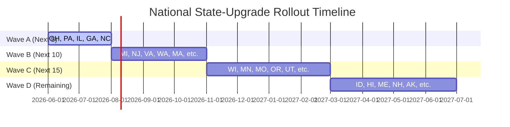

# National State-Upgrade Wave Plan

This document organizes the remaining 47 US jurisdictions into sequential deployment waves (A, B, C, and D) based on population density, user demand, and geographical similarity.

---

## 1. Wave Roadmap

---

## 2. Wave Breakdowns

### Wave A: The High-Value Giants (Next 5 States)
*Target Timeline: Weeks 1 - 8 (1.5 weeks per state average)*
*   **States:** **Ohio (OH)**, **Pennsylvania (PA)**, **Illinois (IL)**, **Georgia (GA)**, **North Carolina (NC)**

> [!NOTE]
> **Ohio was the post-autonomy control state and has successfully PASSED all gates.**
> 
> Multi-state batch ingestion for approved low-risk categories is now ACTIVE. **Geographic local routing layers are strictly suspended from batch promotion** and must remain in single-state mode. School district replacements, primary key re-keying, and regional catchments must be processed state-by-state.

*   **Rationale:** These states contain major metropolitan areas and represent the highest search volume from parents. Sourcing directories are clean, and their local agency models resemble previously upgraded states.
*   **Expected Effort:** Moderate.

### Wave B: Mid-Size Metros & Decoupled Catchments (Next 10 States)
*Target Timeline: Weeks 9 - 20 (1.2 weeks per state average)*
*   **States:** **Michigan (MI)**, **New Jersey (NJ)**, **Virginia (VA)**, **Washington (WA)**, **Massachusetts (MA)**, **Arizona (AZ)**, **Tennessee (TN)**, **Indiana (IN)**, **Maryland (MD)**, **Colorado (CO)**
*   **Rationale:** These states have strong population bases and mature developmental services. Colorado maps well to the LIDDA/Regional Center model via Community Centered Boards (CCBs). New Jersey and Massachusetts are high-value states with dense school district populations.
*   **Expected Effort:** Moderate-to-Complex.

### Wave C: Central & Southern Tier (Next 15 States)
*Target Timeline: Weeks 21 - 36 (1 week per state average)*
*   **States:** **Wisconsin (WI)**, **Minnesota (MN)**, **Missouri (MO)**, **South Carolina (SC)**, **Alabama (AL)**, **Kentucky (KY)**, **Oregon (OR)**, **Oklahoma (OK)**, **Utah (UT)**, **Nevada (NV)**, **Iowa (IA)**, **Kansas (KS)**, **Arkansas (AR)**, **Connecticut (CT)**, **Mississippi (MS)**
*   **Rationale:** These states generally have simpler, county-based health departments or unified state-administered early intervention programs.
*   **Expected Effort:** Easy-to-Moderate.

### Wave D: Frontier & Unified Admin (Remaining 17 Jurisdictions)
*Target Timeline: Weeks 37 - 48 (4 days per state average)*
*   **States:** **New Mexico (NM)**, **Nebraska (NE)**, **West Virginia (WV)**, **Idaho (ID)**, **Hawaii (HI)**, **Maine (ME)**, **New Hampshire (NH)**, **Rhode Island (RI)**, **Montana (MT)**, **Delaware (DE)**, **South Dakota (SD)**, **North Dakota (ND)**, **Alaska (AK)**, **Wyoming (WY)**, **Montana (MT)**, **Vermont (VT)**, **District of Columbia (DC)**
*   **Rationale:** Low populations and largely centralized, state-level administration. Rhode Island, Delaware, Hawaii, and Washington D.C. operate single-district or highly centralized health/benefits portals, making local mapping trivial.
*   **Expected Effort:** Easy (High potential for batch ingestion).

---

## 3. Wave Transition Criteria

Before declaring a wave complete and proceeding to the next, the following exit gates must be passed for every state in that wave:

1.  **Zero-Fallback Verification:** The number of fallback records in `county_offices` and `school_districts` must be exactly **0** for all states in the wave.
2.  **Next.js Production Build Pass:** The Next.js production build (`npm run build`) must compile cleanly with the newly promoted state data.
3.  **Local E2E Smoke Tests Pass:** Playwright integration test suite must execute and pass without failure.
4.  **Local Review Queue Populated:** All private, commercial, and advocacy entities must be isolated in the state's `provider_legal_review_queue.json` file.
